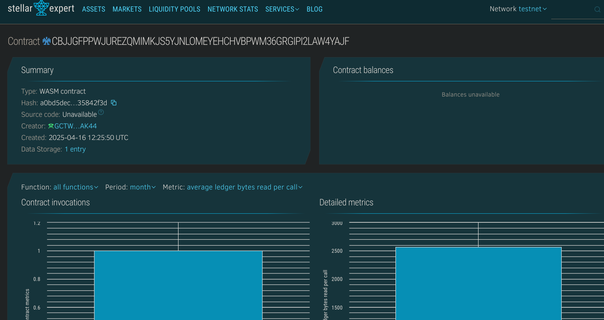

# On-Chain Leaderboard

## 📌 Project Title
**On-Chain Leaderboard**

---

## 📄 Project Description
The On-Chain Leaderboard is a Soroban smart contract that allows users to submit and view player scores directly on the blockchain. It supports individual score tracking and provides a basic leaderboard structure that can be extended for competitive gaming, educational rankings, or gamified applications.

---

## 🎯 Project Vision
The vision behind the On-Chain Leaderboard is to decentralize scoreboards by storing them transparently and securely on-chain. This ensures tamper-proof player data and opens up possibilities for trustless tournaments, prize mechanisms, and community challenges without relying on centralized databases.

---

## 🚀 Key Features
- 🧍 Submit or update scores associated with player addresses
- 🔍 Retrieve scores for any individual player
- 📋 Fetch the entire list of players and their scores
- 💾 On-chain data persistence and transparency

---

## 🔮 Future Scope
- 🥇 Add sorted leaderboard ranking based on scores
- ⏱️ Introduce time-based leaderboards (e.g., weekly, monthly)
- 🏆 Integrate with reward mechanisms for top scorers
- 📈 Dashboard dApp for visualizing on-chain scores
- 👥 Add team-based competition logic

## Contract Details
CBJJGFPPWJUREZQMIMKJS5YJNLOMEYEHCHVBPWM36GRGIPI2LAW4YAJF
